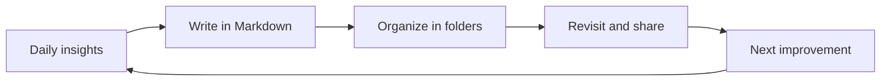

# How Records Connect

Capture ideas, organize documents, and revisit them when needed.
This is a structure for keeping a small cycle going.

## What each document is for

| Document | What it keeps | When to read it |
| --- | --- | --- |
| Overview | The purpose and current work | When you join the project |
| Design notes | The option we chose, and why | Before starting implementation |
| Retrospective | What we learned and the next step | At a milestone |

> The diagram shows the big picture; the text explains the reasoning.
> Having both makes it easier for first-time readers to find their way.

[Back to the project overview](01-project-overview.md)
