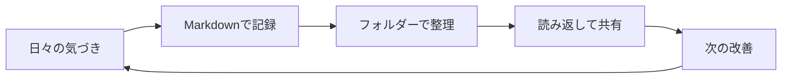

# 記録がつながる仕組み

アイデアを記録し、文書を整理し、必要なときに読み返す。
小さな循環を続けるための構成です。

## 文書の役割

| 文書 | 残すもの | 読むタイミング |
| --- | --- | --- |
| 概要 | 目的と、現在の取り組み | プロジェクトに参加したとき |
| 設計ノート | 選んだ案と、その理由 | 実装を始める前 |
| 振り返り | 分かったことと、次の一歩 | 区切りを迎えたとき |

> 図は全体像、文章は判断の理由。
> 両方があると、初めて読む人も迷いにくくなります。

[プロジェクト概要へ戻る](01-プロジェクト概要.md)
